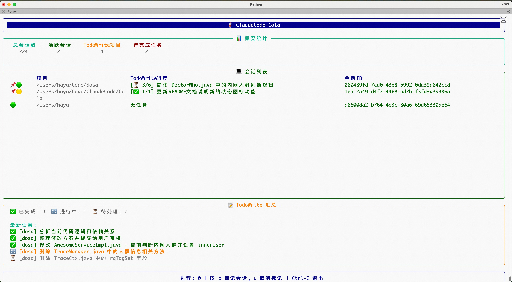

# ClaudeCode-Cola 🥤

🥤Coca-Cola🥤的好兄弟！一个用于实时监控Mac上所有Claude Code会话和TodoWrite状态的工具。

毕竟要想实时了解 **散落在电脑里各个角落里** 的 AI工作进度 是挺头疼的事情。

## 🆕 Mac 应用版本

ClaudeCode-Cola 提供两种使用方式：

### 📱 Mac 应用版（推荐）

**核心功能：**
- ✨ **现代化界面**：macOS 原生风格的图形界面
- 🥤 **系统托盘**：菜单栏常驻，一键访问
- 📊 **实时监控**：自动扫描所有 Claude Code 会话
- 📝 **TodoWrite 集成**：实时显示任务进度
- 📌 **会话管理**：标记、重命名、查看详情
- 🔄 **自动刷新**：文件变化时自动更新

**界面特性：**
- **主窗口**：
  - 会话列表（状态、项目名、位置、TodoWrite进度）
  - 统计面板（总会话数、活跃会话、TodoWrite项目、待完成任务）
  - 右键菜单（标记/取消标记、重命名、查看TodoWrite详情、复制会话ID）
  
- **系统托盘**：
  - 🥤 图标显示会话状态
  - 左键：显示弹出窗口（快速查看会话）
  - 右键：菜单（显示主窗口、退出）
  - 双击：打开主窗口
  - Tooltip：显示会话统计

- **弹出窗口**（320x400）：
  - 显示活跃和标记的会话
  - 快速查看TodoWrite进度
  - 一键打开主窗口

**快速开始：**
```bash
# 1. 克隆项目
git clone <项目地址>

# 2. 运行启动脚本（自动安装依赖）
./run.sh
```

**使用说明：**
- **关闭主窗口**：窗口会隐藏到后台，应用继续运行
- **退出应用**：通过托盘右键菜单选择"退出"
- **会话标记**：右键点击会话，选择"标记会话"
- **会话重命名**：右键点击会话，选择"重命名项目"
- **查看详情**：右键点击有TodoWrite的会话，选择"查看TodoWrite详情"

详细安装说明请查看：[INSTALL.md](INSTALL.md)

## 安装方式

### 方式1：Homebrew Cask（推荐）

```bash
# 方式1：添加 tap 后安装
brew tap haya.lhw/claudecode-cola https://code.alibaba-inc.com/haya.lhw/ClaudeCode-Cola.git
brew install --cask claudecode-cola

# 方式2：直接从仓库安装
brew install --cask https://code.alibaba-inc.com/haya.lhw/ClaudeCode-Cola/-/raw/master/homebrew/claudecode-cola.rb
```

安装后，应用会出现在"应用程序"文件夹中，可以像其他Mac应用一样启动。

### 方式2：手动下载安装

1. 从仓库下载 [DMG 文件](https://code.alibaba-inc.com/haya.lhw/ClaudeCode-Cola/-/raw/master/dist/ClaudeCode-Cola-1.0.0.dmg)
2. 双击打开 DMG
3. 将 ClaudeCode-Cola.app 拖拽到"应用程序"文件夹
4. 从启动台或访达启动应用

### 方式3：开发模式（用于开发和调试）

```bash
# 克隆项目
git clone https://code.alibaba-inc.com/haya.lhw/ClaudeCode-Cola.git
cd ClaudeCode-Cola

# 运行启动脚本
./run.sh
```

## 打包和发布

如果你想自己打包应用或发布新版本，请查看：[发布指南](docs/RELEASE.md)

### 💻 命令行版（传统版本）
- 🎨 **终端UI**：基于 Rich 库的美观终端界面
- ⌨️ **快捷操作**：键盘快捷键标记会话
- 📊 **实时刷新**：动态更新显示

**使用命令行版：**
```bash
python claudecode_cola.py
```

参见下方的"启动和关闭"章节了解更多

---

## 页面
别说丑，这叫质朴。

小窗口：


🟢 代表会话**活跃中**：它正在努力干活，不用关注。

🟡 代表会话**不活跃**：它需要你回复或者已完成，你应该去看一眼了。

📌 代表会话**被标记**：不被标记的会话如果不活跃了，就不会展示出来了。

放大后：



唯一的操作（程序最下方也有提示）：

按 p + 会话ID 就可以**标记会话📌**，被标记的会话就会一直出现在页面里。

按 u + 会话ID 接可以**取消标记**。

## 背景
我经常同时开多个Claude Code让他们去干不同的事情。这些会话有的在mac终端里，有的在IDEA的多个项目窗口里（IDEA插件），有的在多个VsCode窗口里（Oneday插件）。

1. 我希望有个地方能清晰地看到我电脑上所有AI当前的干活进度。

2. 如果终端/IDEA/VsCode窗口被我关闭了，那附带的Claude Code会话有时候也就没了，需要通过“claude -r”在列表里慢慢翻找恢复了。而Anthropic官方的这个恢复功能我感觉做的也不是很好用，我看那个Claude Code自己起的会话名我也不知道这会话里面有啥。

这个工具原本是我写给自己用的，但我想想可能也有别人遇到了和我一样的问题，所以就放在内网里，有需要的同事都可以用。

往深了想想，我其实希望的是有一个Manager来帮我管理所有的任务和Claude Code会话，后面集团中应该会有大佬产出类似的工具或者产品，坐等。

## 功能特性

- 🔍 **全局监控**：自动扫描并监控所有Claude Code会话
- 📝 **TodoWrite追踪**：实时显示每个会话的TodoWrite任务状态
- 🟢 **活跃状态**：识别活跃和非活跃会话
- 📌 **会话标记**：使用便捷的shell脚本标记/取消标记会话
- 📊 **统计面板**：显示会话总数、活跃数、任务进度等
- 🔄 **实时更新**：文件变化时自动更新显示
- 🎨 **美观界面**：使用Rich库构建的终端UI

## 环境要求

- **操作系统**: macOS 10.14 (Mojave) 或更高版本
- **Python版本**: 3.8 或更高版本
- **依赖库**: PyQt6（启动脚本会自动安装）
- **Shell**: bash/zsh（用于运行启动脚本）

## 启动和关闭

### 启动程序

启动脚本会自动处理所有设置：

```bash
# 1. 通过git clone到本地
git clone $git中ssh/http链接

# 2. 在项目目录下运行启动脚本
./run.sh
```

启动脚本会自动：
- 创建虚拟环境（如果不存在）
- 激活虚拟环境
- 安装/更新依赖
- 启动监控程序

### 关闭程序

有以下几种方式关闭监控程序：

1. **正常关闭**（推荐）：按 `Ctrl+C`
   - 程序会优雅地关闭所有监控器和清理资源

2. **强制关闭**：连续按两次 `Ctrl+C`
   - 如果程序没有响应，可以强制退出

## 界面说明

监控界面分为以下几个部分：

1. **标题栏**：显示程序名称
2. **统计面板**：显示总会话数、活跃会话、TodoWrite项目数、待完成任务数
3. **会话列表**：
   - 显示项目名、TodoWrite进度、会话ID
   - **状态图标说明**：
     - 📌🟢 **标记且活跃** - 正在工作的重要会话
     - 📌🟡 **标记但不活跃** - ⚠️ 需要关注！可能已完成或需要确认
     - 🟢 **活跃但未标记** - 普通工作会话
4. **TodoWrite汇总**：
   - 任务统计（已完成/进行中/待处理）
   - 最新任务列表

## 监控原理

1. **数据源**：监控 `~/.claude/projects/` 目录下的所有 `.jsonl` 文件
2. **实时监控**：使用 watchdog 监听文件系统变化
3. **进程监控**：使用 psutil 监控 Claude 进程状态
4. **增量读取**：只读取文件新增内容，提高性能

## 会话标记功能

ClaudeCode-Cola 支持会话标记功能，被标记的会话会常驻显示在列表中，无论是否活跃。

### 标记会话
可以在程序中直接 p + 会话ID 进行标记（推荐，方便），也可以在程序外侧使用脚本标记：

```bash
# 使用shell脚本
./pin_session.sh <会话ID>
```

### 取消标记会话
可以在程序中直接 u + 会话ID 取消标记（推荐，方便），也可以在程序外侧使用脚本取消：

```bash
# 使用shell脚本
./unpin_session.sh <会话ID>
```

### 查看所有被标记的会话
```bash
# 查看所有被标记的会话详情
./list_pinned_sessions.sh
```

### 智能状态提醒 🎯

当标记的会话关闭后，系统会通过 **黄色圆点 🟡** 提醒你：

- **📌🟡 状态**：表示这个会话被你标记了，但目前已经关闭
- **可能的情况**：
  - ✅ 任务已完成，可以取消标记了
  - ⏸️ 暂时搁置，等待某些条件后继续
  - 🔍 需要你确认下一步操作

这个设计帮助你快速识别哪些标记的会话需要你的注意！

**功能说明**:

1. **会话存在性检测** (标记时自动检测):
   - ✅ 会自动检查会话是否存在
   - ✅ 如果会话不存在,会给出明确的错误提示
   - ✅ 如果会话已被标记,会提示该会话已被标记
   - ✅ 标记成功后会显示会话所属的项目路径

2. **查看标记列表** (新增脚本):
   - 📌 显示所有被标记的会话ID和对应项目
   - ⚠️ 自动检测无效会话(文件已删除)
   - 💡 提供清理建议,方便取消标记无效会话

标记状态会在程序重启后保持，已标记的会话会自动加载并显示。

## 快捷键

- `Ctrl+C`：退出程序

## 注意事项

- 首次启动时会扫描所有历史会话，可能需要几秒钟
- 会话文件较多时（1000+）可能会占用一定内存
- 建议在独立终端窗口中运行，以获得最佳显示效果
