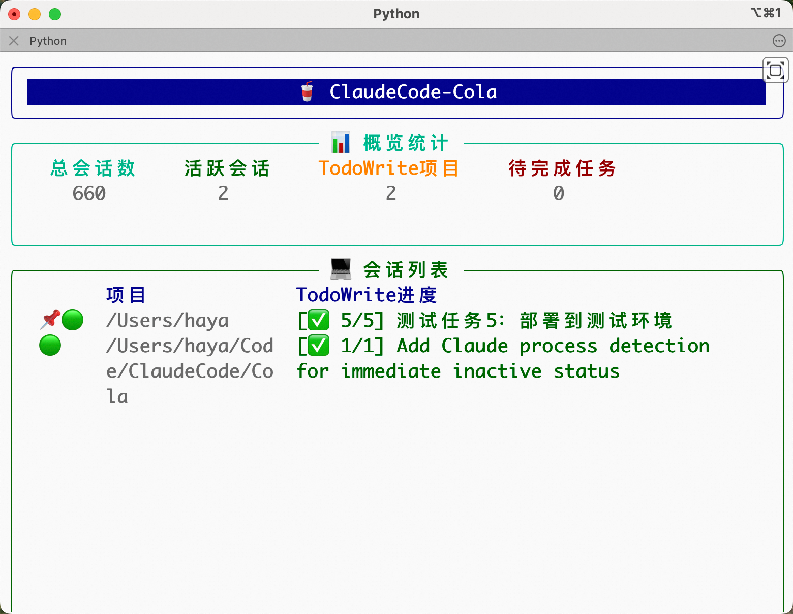
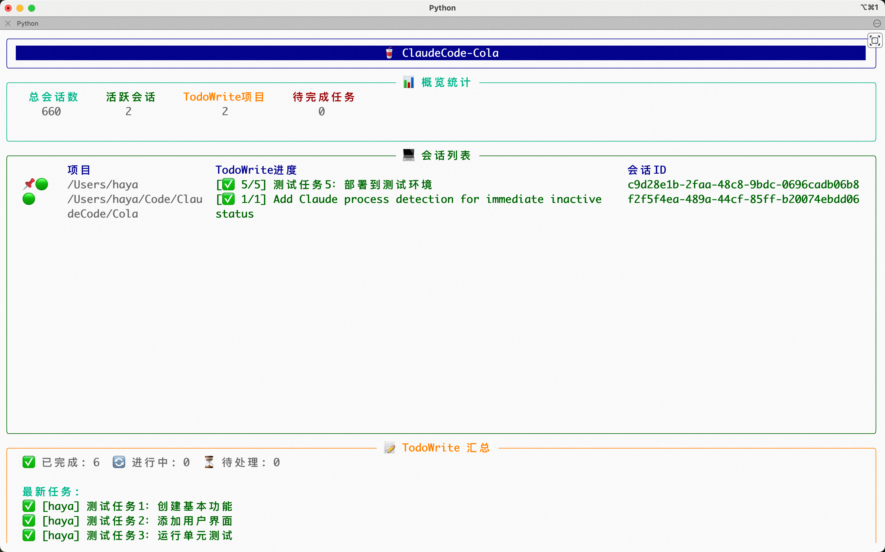

# ClaudeCode-Cola 🥤

Coca-Cola的好兄弟！一个用于实时监控Mac上所有Claude Code会话和TodoWrite状态的工具。

## 页面
别说丑，这叫质朴。

小窗口：


放大后：


## 背景
我经常同时开多个Claude Code让他们去干不同的事情。这些会话有的在mac终端里，有的在IDEA的多个项目窗口里（IDEA插件），有的在多个VsCode窗口里（Oneday插件）。

1. 我希望有个地方能清晰地看到我电脑上所有AI当前的干活进度。

2. 如果终端/IDEA/VsCode窗口被我关闭了，那附带的Claude Code会话有时候也就没了，需要通过“claude -r”在列表里慢慢翻找恢复了。而Anthropic官方的这个恢复功能我感觉做的也不是很好用，我看那个Claude Code自己起的会话名我也不知道这会话里面有啥。

这个工具原本是我写给自己用的，但我想想可能也有别人遇到了和我一样的问题，所以就放在内网里，有需要的同事都可以用。

往深了想想，我其实希望的是有一个Manager来帮我管理所有的任务和Claude Code会话，后面集团中应该会有大佬产出类似的工具或者产品，坐等。

## 功能特性

- 🔍 **全局监控**：自动扫描并监控所有Claude Code会话
- 📝 **TodoWrite追踪**：实时显示每个会话的TodoWrite任务状态
- 🟢 **活跃状态**：识别活跃和非活跃会话
- 📌 **会话标记**：使用便捷的shell脚本标记/取消标记会话
- 📊 **统计面板**：显示会话总数、活跃数、任务进度等
- 🔄 **实时更新**：文件变化时自动更新显示
- 🎨 **美观界面**：使用Rich库构建的终端UI

## 启动和关闭

### 启动程序

启动脚本会自动处理所有设置：

```bash
# 在项目目录下运行启动脚本
./run.sh
```

启动脚本会自动：
- 创建虚拟环境（如果不存在）
- 激活虚拟环境
- 安装/更新依赖
- 启动监控程序

### 关闭程序

有以下几种方式关闭监控程序：

1. **正常关闭**（推荐）：按 `Ctrl+C`
   - 程序会优雅地关闭所有监控器和清理资源

2. **强制关闭**：连续按两次 `Ctrl+C`
   - 如果程序没有响应，可以强制退出

## 界面说明

监控界面分为以下几个部分：

1. **标题栏**：显示程序名称
2. **统计面板**：显示总会话数、活跃会话、TodoWrite项目数、待完成任务数
3. **会话列表**：
   - 📌🟢 既是标记又是活跃的会话
   - 📌 只是标记的会话（常驻显示）
   - 🟢 只是活跃的会话
   - 显示项目名、TodoWrite进度、会话ID
4. **TodoWrite汇总**：
   - 任务统计（已完成/进行中/待处理）
   - 最新任务列表

## 监控原理

1. **数据源**：监控 `~/.claude/projects/` 目录下的所有 `.jsonl` 文件
2. **实时监控**：使用 watchdog 监听文件系统变化
3. **进程监控**：使用 psutil 监控 Claude 进程状态
4. **增量读取**：只读取文件新增内容，提高性能

## 会话标记功能

ClaudeCode-Cola 支持会话标记功能，被标记的会话会常驻显示在列表中，无论是否活跃。

### 标记会话
```bash
# 使用shell脚本（推荐）
./pin_session.sh <会话ID>
```

### 取消标记会话
```bash
# 使用shell脚本（推荐）
./unpin_session.sh <会话ID>
```

标记状态会在程序重启后保持，已标记的会话会自动加载并显示。

## 快捷键

- `Ctrl+C`：退出程序

## 注意事项

- 首次启动时会扫描所有历史会话，可能需要几秒钟
- 会话文件较多时（1000+）可能会占用一定内存
- 建议在独立终端窗口中运行，以获得最佳显示效果