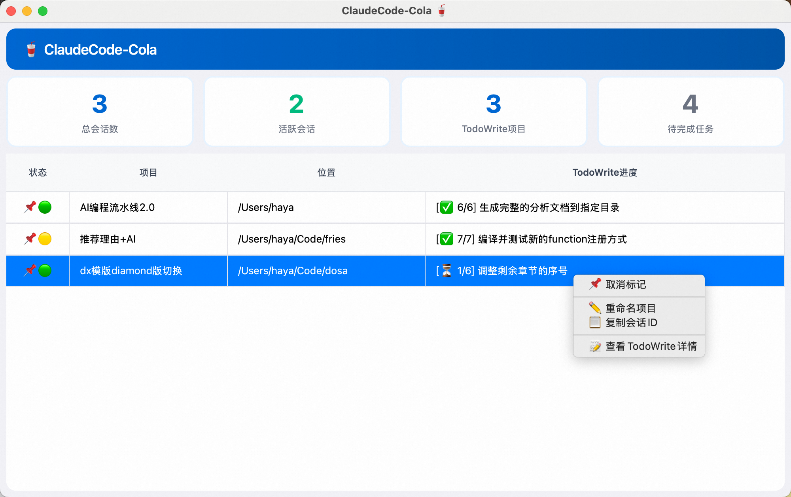
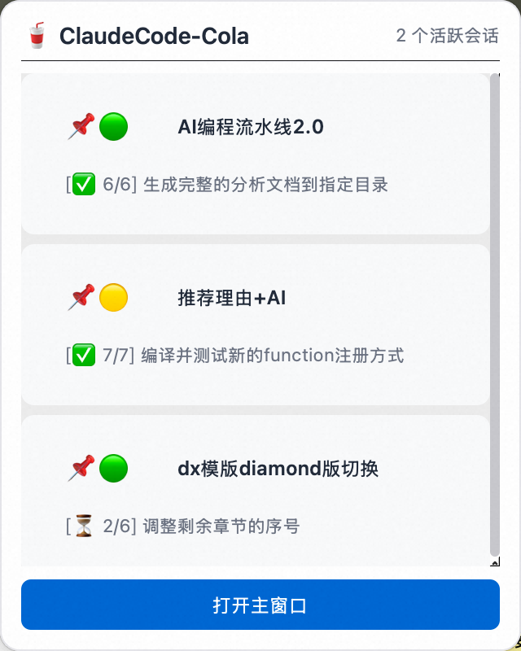
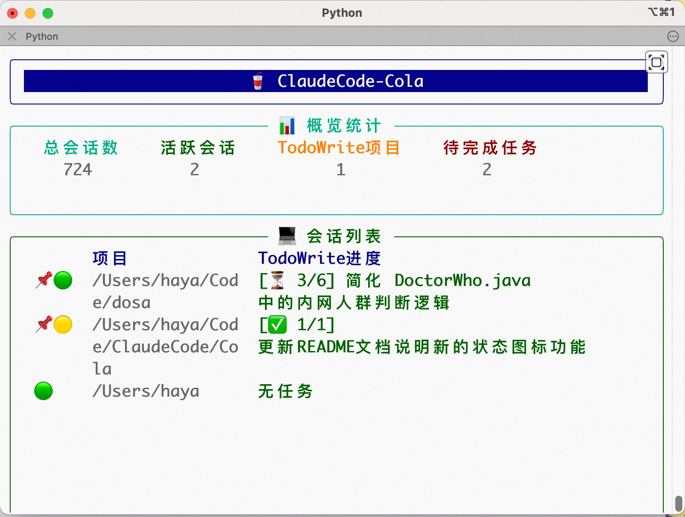

# ClaudeCode-Cola 🥤

🥤Coca-Cola🥤的好兄弟！一个用于实时监控Mac上所有Claude Code会话和TodoWrite状态的工具。

毕竟要想实时了解 **散落在电脑里各个角落里** 的 AI工作进度 是挺头疼的事情。

## 📱 界面预览

ClaudeCode-Cola 提供两种使用方式：**Mac GUI 应用版**（推荐）和 **CLI 命令行版**

### Mac 应用版（推荐）

**主窗口：**



**状态栏窗口：**



**核心功能：**
- ✨ **现代化界面**：macOS 原生风格的图形界面
- 🥤 **系统托盘**：菜单栏常驻，一键访问
- 📊 **实时监控**：自动扫描所有 Claude Code 会话
- 📝 **TodoWrite 集成**：实时显示任务进度
- 📌 **会话管理**：标记、重命名、查看详情
- 🔄 **自动刷新**：文件变化时自动更新

**状态图标说明：**
- 🟢 会话**活跃中**：正在努力干活，不用关注
- 🟡 会话**不活跃**：需要你回复或已完成，应该去看一眼
- 📌 会话**被标记**：不被标记的会话如果不活跃了，就不会展示出来

### CLI 命令行版

**主窗口（缩小）：**



**主窗口（全屏）：**


**核心功能：**
- 🎨 **终端UI**：基于 Rich 库的美观终端界面
- ⌨️ **快捷操作**：键盘快捷键标记会话（按 p 标记，按 u 取消标记）
- 📊 **实时刷新**：动态更新显示

**状态图标说明：**
- 🟢 会话**活跃中**：正在努力干活，不用关注
- 🟡 会话**不活跃**：需要你回复或已完成，应该去看一眼
- 📌 会话**被标记**：不被标记的会话如果不活跃了，就不会展示出来

## 🚀 安装方式

### Homebrew Cask（推荐 - 安装 Mac GUI 应用版）

通过 Homebrew Cask 安装的是 **Mac GUI 应用版**，安装后可以从启动台或应用程序文件夹启动。

```bash
brew tap HayaKus/claudecode-cola
brew install --cask claudecode-cola
```

### 开发模式运行（支持 Mac 版和 CLI 版）

如果你想从源码运行，或者想使用 **CLI 命令行版**，可以通过以下方式：

```bash
# 1. 克隆项目
git clone <项目地址>
cd ClaudeCode-Cola

# 2. 运行对应版本的启动脚本
./run_mac.sh    # Mac GUI 应用版
./run_cli.sh    # CLI 命令行版
```

启动脚本会自动创建虚拟环境、安装依赖并启动应用。

## 背景
我经常同时开多个Claude Code让他们去干不同的事情。这些会话有的在mac终端里，有的在IDEA的多个项目窗口里（IDEA插件），有的在多个VsCode窗口里（Oneday插件）。

1. 我希望有个地方能清晰地看到我电脑上所有AI当前的干活进度。

2. 如果终端/IDEA/VsCode窗口被我关闭了，那附带的Claude Code会话有时候也就没了，需要通过“claude -r”在列表里慢慢翻找恢复了。而Anthropic官方的这个恢复功能我感觉做的也不是很好用，我看那个Claude Code自己起的会话名我也不知道这会话里面有啥。

这个工具原本是我写给自己用的，但我想想可能也有别人遇到了和我一样的问题，所以就放在内网里，有需要的同事都可以用。

往深了想想，我其实希望的是有一个Manager来帮我管理所有的任务和Claude Code会话，后面集团中应该会有大佬产出类似的工具或者产品，坐等。

## 功能特性

- 🔍 **全局监控**：自动扫描并监控所有Claude Code会话
- 📝 **TodoWrite追踪**：实时显示每个会话的TodoWrite任务状态
- 🟢 **活跃状态**：识别活跃和非活跃会话
- 📌 **会话标记**：使用便捷的shell脚本标记/取消标记会话
- 📊 **统计面板**：显示会话总数、活跃数、任务进度等
- 🔄 **实时更新**：文件变化时自动更新显示
- 🎨 **美观界面**：使用Rich库构建的终端UI

## 环境要求

- **操作系统**: macOS 10.14 (Mojave) 或更高版本
- **Python版本**: 3.8 或更高版本
- **Shell**: bash/zsh（用于运行启动脚本）

## 监控原理

1. **数据源**：监控 `~/.claude/projects/` 目录下的所有 `.jsonl` 文件
2. **实时监控**：使用 watchdog 监听文件系统变化
3. **进程监控**：使用 psutil 监控 Claude 进程状态
4. **增量读取**：只读取文件新增内容，提高性能

## 会话标记功能

ClaudeCode-Cola 支持会话标记功能，被标记的会话会常驻显示在列表中，无论是否活跃。

### 标记会话
Mac版可直接右键标记会话，而CLI版中直接 p + 会话ID 进行标记（推荐，方便），也可以在程序外侧使用脚本标记：

```bash
# 使用shell脚本
./pin_session.sh <会话ID>
```

### 取消标记会话
Mac版可直接右键取消标记会话，CLI版中直接 u + 会话ID 取消标记（推荐，方便），也可以在程序外侧使用脚本取消：

```bash
# 使用shell脚本
./unpin_session.sh <会话ID>
```

### 查看所有被标记的会话
```bash
# 查看所有被标记的会话详情
./list_pinned_sessions.sh
```